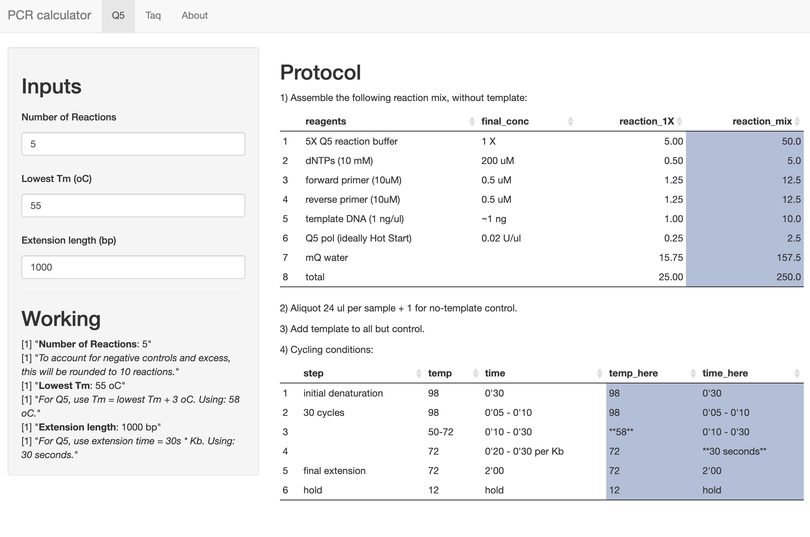

# pcr_calc

pcr_calc is a simple calculator to work out master mixes and cycling conditions to be used for Q5 and Taq polymerase PCR reactions, based on the protocols provided by NEB.

It is a Shiny app (written in R), located [here](https://ec363.shinyapps.io/pcr_calc/).

---

